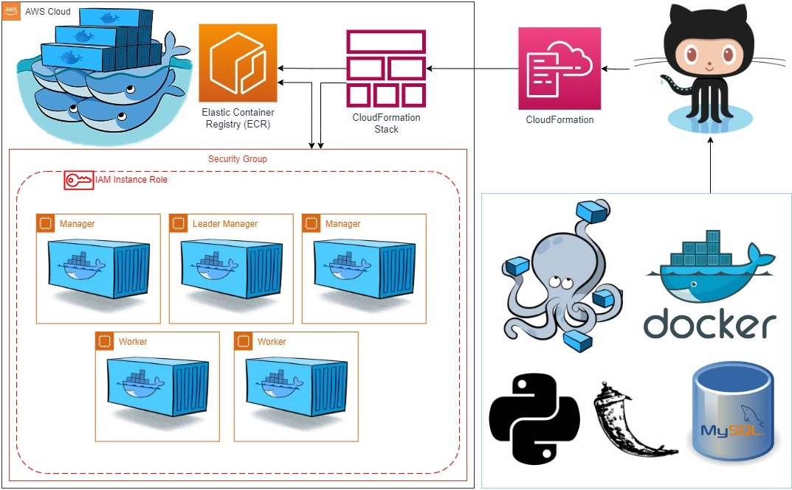
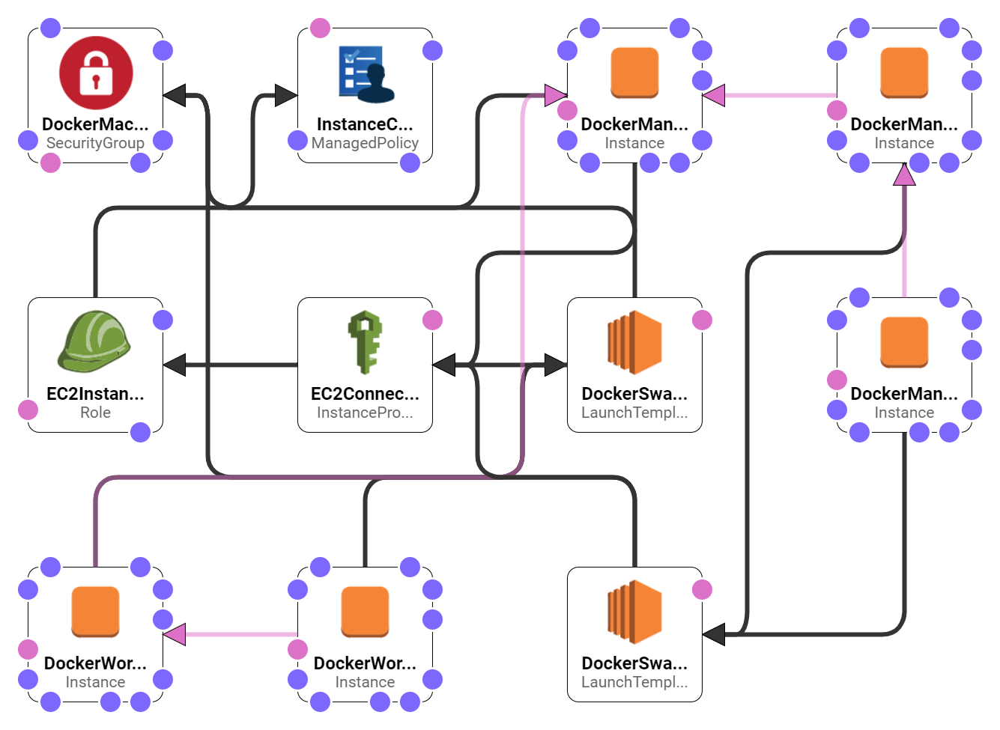
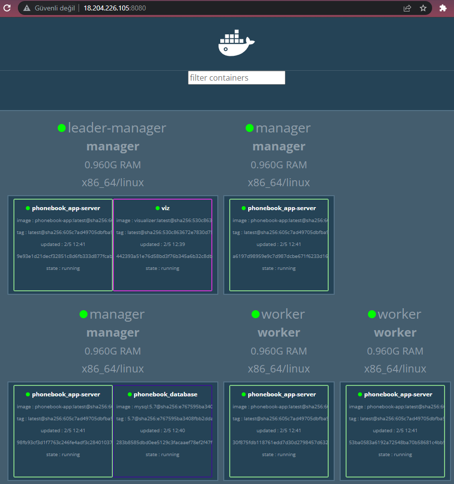
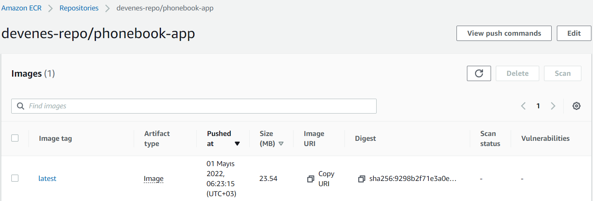
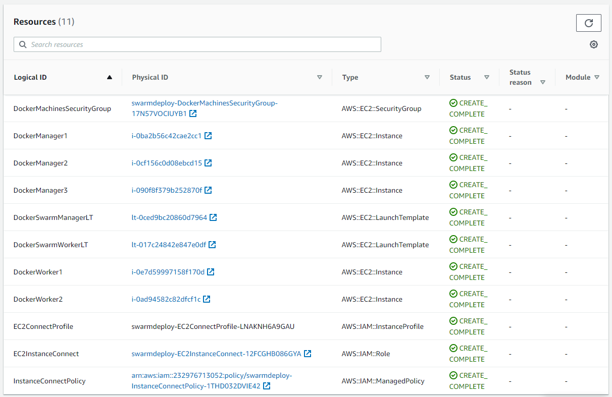
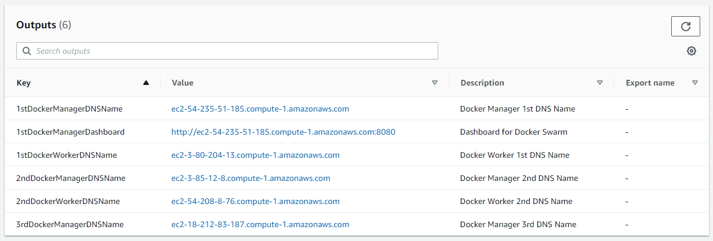
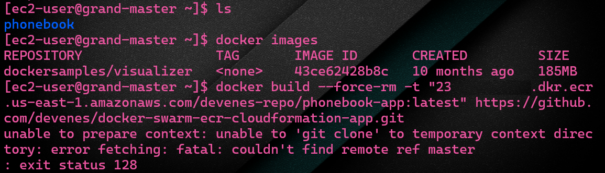

# Automated Docker Swarm Deployment of Python Flask Web App using AWS CloudFormation

## Description

This project aims to deploy a phonebook web application with Docker Swarm on Elastic Compute Cloud (EC2) Instances by pulling the app images from AWS Elastic Container Registry (ECR) repository using AWS CloudFormation.

## Project Architecture





## Docker Swarm Cluster



## Elastic Container Registry Repository



## AWS CloudFormation Stack Events


## AWS CloudFormation Stack Resources



## AWS CloudFormation Stack Outputs



## Case Study Details

- Your company has recently started a project that aims to serve as phonebook web application. Your teammates have started to work on the project and developed the UI and backend part of the project and they need your help to deploy the app in development environment.

- You are, as a Cloud/DevOps engineer, requested to deploy the Phonebook Application in the development environment on Docker Swarm on AWS EC2 Instances using AWS CloudFormation to showcase the project. To do that you need to;

  - Create a new public repository for the project on GitHub.

  - Create docker image using the `Dockerfile` from the base image of `python:alpine`.

  - Deploy the app on swarm using `docker compose`. To do so on the `Compose` file;

    - Create a MySQL database service with one replica using the image of `mysql:5.7`;

      - attach a named volume to persist the data of database server.

      - attach `init.sql` file to initialize the database using `configs`.

    - Configure the app service to;

      - pull the image of the app from the AWS ECR repository.

      - deploy the one app for each swarm nodes using `global` mode.

      - run the app on `port 80`.

    - Use a user-defined overlay network for the services.

  - Push the necessary files for your project from local repo to the new github repo (phonebookswarm).

- You are also requested; to use AWS ECR as image repository, to create Docker Swarm with 3 manager and 2 worker node instances, to automate the process of Docker Swarm initialization through AWS CloudFormation template in the development environment. To achieve this goals, you can configure AWS CloudFormation template file using the followings;

  - The application should run on Amazon Linux 2 EC2 Instance

  - EC2 Instance type can be configured as `t2.micro`.

  - To use the AWS ECR as image repository;

    - Enable the swarm node instances with IAM Role allowing them to work with ECR repos using the instance profile.

    - Install AWS CLI `Version 2` on swarm node instances to use `aws ecr` commands.

  - To automate the process of Docker Swarm initialization;

    - Install the docker and docker-compose on all nodes (instances) using the `user-data` bash script.

    - Create the leader manager node of the swarm. Within the `user-data` script;

      - Set the first manager node hostname as `Leader-Manager`.

      - Initialize Docker swarm.

      - Create a docker service named `viz` on the manager node on port `8080` using the `dockersamples/visualizer` image, to monitor the swarm nodes easily.

      - Build the docker image from the GitHub URL of the new project repo and tag it appropriately to push it on ECR repo. (Note: Do not forget to install Git to enable Docker to work with git commands)

      - Download `docker-compose.yml` file from the repo and deploy application stack on Docker Swarm.

    - Create two manager nodes of the swarm. Within the `user-data` script;

      - Install the python `ec2instanceconnectcli` package for `mssh` command.

      - Connect from manager node to the `Leader-Manager` to get the `join-token` and join the swarm as manager node using `mssh` command.

    - Create two worker nodes of the swarm. Within the `user-data` script;

      - Install the python `ec2instanceconnectcli` package to use `mssh` command.

      - Connect from worker node to the `Leader-Manager` to get the `join-token` and join the swarm as worker node using `mssh` command.

  - Create a security group for all swarm nodes and open necessary ports for the app and swarm services.

  - Create an image repository on ECR for the app.

  - Tag the swarm node instances appropriately as `Docker-Swarm-Manager <Number>/Docker-Swarm-Worker <Number>` to discern them from AWS Management Console.

  - The Web Application should be accessible via web browser from anywhere.

  - Phonebook App Website URL, Visualization App Website URL should be given as output by AWS CloudFormation Service, after the stack created.

## Error: `unable to prepare context`

You will have the following error when you try to build your image from your GitHub repository using the `docker build` command for building and pushing the image to the AWS ECR repository later on.

- Please check your branch name on GitHub repository.
- And make sure that it is not a branch name that is not allowed to be used for Docker build.
- Your branch name should be `master` which is allowed to be used for Docker build in this case.

```bash
[ec2-user@grand-master ~]$ docker build --force-rm -t "12345678910.dkr.ecr.us-east-1.amazonaws.com/infraform-repo/phonebook-app:latest" https://github.com/infraform/docker-swarm-elastic-container-app.git
unable to prepare context: unable to 'git clone' to temporary context directory: error fetching: fatal: couldn't find remote ref master
:exit status 128
```



---

### At the end of the project, following topics are to be covered;

- Docker Swarm Deployment

- Web App and MySQL Database Configuration in Docker Swarm

- Container Overlay Networking

- Container Orchestration and Solutions Architecture

- Bash scripting

- AWS ECR as Image Repository

- AWS IAM Policy and Role Configuration

- AWS EC2 Configuration

- AWS EC2 Security Group Configuration

- AWS CloudFormation Template Configuration

- Git & Github for Version Control System

## Resources

- [AWS CLI Command Reference](https://docs.aws.amazon.com/cli/latest/index.html)

- [Docker Compose File Reference](https://docs.docker.com/compose/compose-file/)

- [Docker Reference Page](https://docs.docker.com/reference/)

- [EC2 Instance Connect](https://docs.aws.amazon.com/AWSEC2/latest/UserGuide/Connect-using-EC2-Instance-Connect.html)

- [Amazon Elastic Container Registry Documentation](https://docs.aws.amazon.com/ecr/index.html)

- [Docker Swarm](https://docs.docker.com/engine/swarm)

- [AWS CloudFormation](https://aws.amazon.com/cloudformation/)
